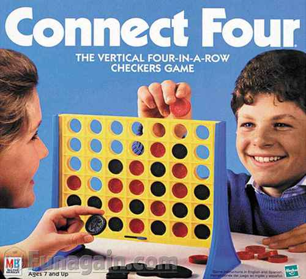

### Connect 4

Write a _Connect 4_ game that allows two players to compete. The players are sharing the same computer but the game detects when a player has won the game. A scoreboard keeps track of how many times Player 1 has won and how many times Player 2 has won.

#### Bonus Ideas:

* Alternate the first player to move: Player 1 moves first in game 1, Player 2 moves first in game 2, etc.
* Allow players to enter their name and display their name instead of "Player 1" and "Player 2".
* Provide a way to play against the computer (using a simple A.I. algorithm)

Trello Board: https://trello.com/b/NLl1oTaX/welcome-board

